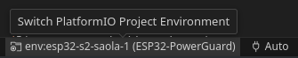
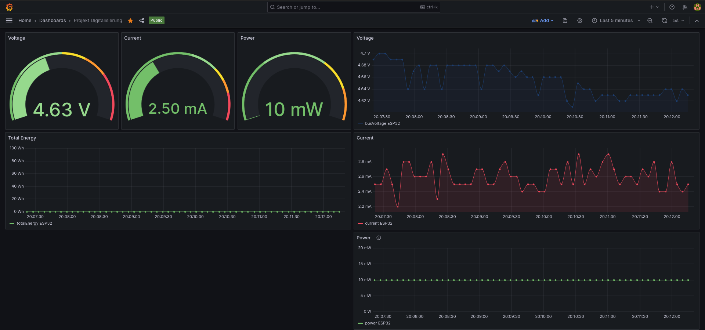

# ESP32-PowerGuard - Digitalisierung in der Energietechnik

Dieses Repository enthält den Quellcode für unser Gruppenprojekt an der Universität, das sich auf die Digitalisierung der Energietechnik im industriellen Sektor konzentriert. Unser Projekt zielt darauf ab, eine sichere Stromverteilung für Retrofit-Mobile-Roboter mit leistungsfähigen Mini-PCs zu gewährleisten. Wir wollten jedoch eine Lösung entwickeln, die auf jeden Stromkreis angewendet werden kann. Dies führte zu einem kleinen Projekt mit ESP32 und einigen Relais-Boards.

### Hauptfunktionen:

- ESP32-basierte Leistungsüberwachung für Spannung und Verbrauch.
- Integration von 2 Relais-Boards zur Vermeidung unvorhergesehener Spannungsbedingungen.
- Datenprotokollierung in InfluxDB für umfassende Analysen.
- Grafana-Dashboard zur Visualisierung der Strombedingungen.
- Eingebetteter Webserver auf dem ESP32 für Echtzeit-Spannungs- und Leistungsmessungen sowie Relaissteuerung.

### Wichtiger Hinweis:
Dieser Code sollte mit allen Arten von ESP32-Geräten (ESP32, ESP32-S1, ESP32-S2 usw.) funktionieren, aber möglicherweise sind geringfügige Anpassungen erforderlich. In jedem Fall müssen Sie die Pin-Nummerierung an Ihr Board anpassen.
Wir haben die folgenden Geräte erfolgreich getestet:
- AZ Delivery ESP-32 Dev Kit C V4
- ESP32-S2-Saola-1

Das Relaismodul ist auch mit anderen auf Amazon erhältlichen Relaismodulen austauschbar. Der Code ist so geschrieben, dass er leicht an andere Module angepasst werden kann. Hier ist zu beachten, dass dieser Code für aktive Low-Relaismodule geschrieben ist.

### Schnellstart
0. ! Bevor Sie den ESP über USB anschließen, vergewissern Sie sich, dass der zusätzliche 5V-Spannungswandler, den wir in diesem Projekt verwenden, ausgesteckt ist. Dies ist notwendig, um eine Überlastung des USB-Anschlusses des Computers zu verhindern.
1. Starten Sie InfluxDb und Grafana über Docker Compose:

    ```shell
    docker compose up -d
    ```

2. Öffnen Sie diesen Ordner mit Visual Studio Code und installieren Sie das PlatformIO-Plugin.
3. Benennen Sie `secrets.h.example` in `secrets.h` um und füllen Sie Ihre Anmeldeinformationen aus.
4. Flashen Sie den ESP32 mit dem Code. Schließen Sie das INA219-Modul gemäß den Schaltplänen an und schalten Sie den ESP32 ein.
5. Der ESP32 verbindet sich mit Ihrem WLAN und beginnt, Daten an die InfluxDB zu senden. Das InfluxDB-Web-GUI ist unter [http://localhost:8086](http://localhost:8086) verfügbar. Sie können nun das Grafana-Dashboard starten und es mit der InfluxDB verbinden. Das Grafana-Dashboard ist unter [http://localhost:3000](http://localhost:3000) verfügbar.
6. Steuern Sie den ESP32 über den Webserver unter `http://<ESP_IP>:80`.
   Die IP-Adresse des ESP32 können Sie aus der seriellen Konsole abrufen.

## Anleitung:
### Inhalt dieses Repositories
- `platformio.ini`: Enthält die Konfiguration für das PlatformIO-Plugin.
- `docker-compose.yml`: Enthält die Konfiguration für das Docker-Compose-Setup.
- `src`: Enthält den Quellcode für den ESP32.
- `doc`: Hier finden Sie die Schaltpläne und die Projektdokumentation.

### Benötigte Hardware:
- ESP32-S2-Saola-1 (oder Ableitung)
- Relaismodulplatine mit 4x Relais (oder ähnlich)
- INA219-Leistungsüberwachungsmodul
- Computer/Server zum Hosten der Datenbank und von Grafana.
Der Code wurde unter Verwendung des PlatformIO-Plugins für Visual Studio Code geschrieben. Es wird empfohlen, die gleiche Einrichtung zu verwenden.

Klonen Sie dieses Repository:
```shell
git clone https://github.com/bjoernellens1/ESP32-PowerGuard.git
```

### Richten Sie Ihre Dienste ein
Installieren Sie die neueste Version von Docker und Docker Compose:
    [https://docs.docker.com/get-docker/](https://docs.docker.com/get-docker/)

Starten Sie die Dienste über:
```shell
docker compose up -d
```

Jetzt können Sie auf das Grafana und InfluxDB über das Web-GUI zugreifen.

Das Grafana-Dashboard ist unter [http://localhost:3000](http://localhost:3000) verfügbar.

Das InfluxDB-Web-GUI ist unter [http://localhost:8086](http://localhost:8086) verfügbar.

Mit laufenden Diensten ist es an der Zeit, den Einrichtungsassistenten in InfluxDB zu starten. Melden Sie sich mit dem Benutzernamen 'influxUser' und dem Passwort 'influxUserPW' an.
Auf der Willkommensseite sehen Sie das Arduino-Einrichtungstutorial. Klicken Sie auf die Schaltfläche 'Arduino' und folgen Sie den Anweisungen. Hier erhalten Sie Parameter, die im nächsten Schritt benötigt werden.

### ESP32 einrichten
#### Hardware-Einrichtung
Schließen Sie das INA219-Modul gemäß den Schaltplänen an. 
Schließen Sie das Relaismodul an den ESP32 an. Das Relaismodul sollte mit den Pins GPIO2 und GPIO15 des ESP32 verbunden sein. Das Relaismodul sollte von einer externen Stromversorgung gespeist werden. Das Relaismodul sollte mit dem Stromkreis verbunden werden, den Sie überwachen und steuern möchten. Das INA219-Modul sollte mit dem Stromkreis verbunden werden, den Sie überwachen möchten. Das INA219-Modul sollte vom ESP32 mit Strom versorgt

 werden.


#### Software-Einrichtung
Verbinden Sie den ESP über ein USB-Kabel mit Ihrem PC. Installieren Sie Visual Studio Code und das PlatformIO-Plugin aus dem Extension Store.
Öffnen Sie diesen Ordner in Visual Studio Code. Die PlatformIO-Willkommensseite wird automatisch geöffnet, und erforderliche Pakete sollten installiert werden.

Ändern Sie dann einige Dateien, um Ihre Konfiguration einzuschließen:

Benennen Sie `secrets.h.example` in `secrets.h` um und füllen Sie Ihre Anmeldeinformationen aus. INFLUXDB_TOKEN ist das Token, das Sie im vorherigen Schritt erhalten haben. INFLUXDB_ORG ist der von Ihnen gewählte Organisationsname. INFLUXDB_BUCKET ist der von Ihnen gewählte Bucket-Name. INFLUXDB_URL ist die URL Ihrer InfluxDB-Instanz. In unserem Fall hosten wir sie lokal, daher müssen wir die IP-Adresse des PCs gefolgt vom InfluxDB-Port eingeben, zum Beispiel:

```
INFLUXDB_URL = "http://192.168.1.100:8086"
```

 WIFI_SSID und WIFI_PASS sind Ihre WLAN-Anmeldeinformationen.

Stellen Sie sicher, dass die richtige Umgebung für das Projekt ausgewählt ist. Standardmäßig handelt es sich um den ESP32-S2-Saola-1. Sie können die Umgebung in der unteren Leiste von Visual Studio Code ändern.


 

Jetzt können Sie auf die Schaltfläche "Upload" klicken, um den ESP zu flashen.


Verwenden Sie den Seriellen Monitor, um die Ausgabe des ESP zu sehen. Sie sehen die IP-Adresse des ESP. Sie können jetzt auf den Webserver unter `http://<ESP_IP>:80` zugreifen.
Außerdem sollte der ESP jetzt in der Lage sein, Daten an die Datenbank zu senden. Jetzt sollten die Daten in der Datenbank erscheinen. Zur Vereinfachung wurde das Grafana-Dashboard im Verzeichnis config/grafana bereits vorkonfiguriert, sodass Sie bereits Folgendes sehen sollten:

##### Grafana


##### Webserver


### Weitere Informationen
Für weitere Informationen schauen Sie sich diese Links an:

[Grafana](https://grafana.com/)

[InfluxDB](https://www.influxdata.com/)

[PlatformIO](https://platformio.org/)

[Visual Studio Code](https://code.visualstudio.com/)


Erkunden Sie den Code, beteiligen Sie sich und geben Sie Feedback.

An dieser Stelle möchte ich meinen Projektpartnern Yiuliya Varsh und Cyrus Emami für ihre Unterstützung und Hilfe danken.