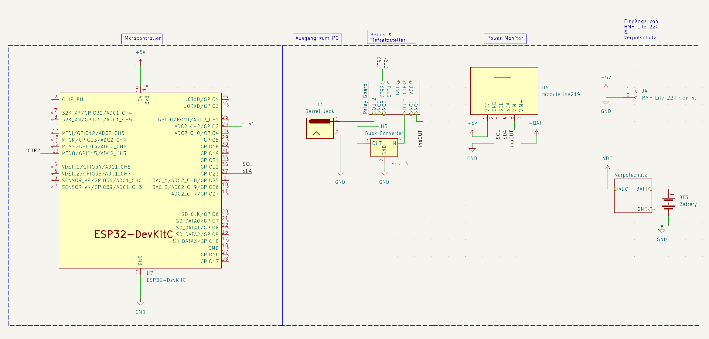
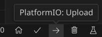
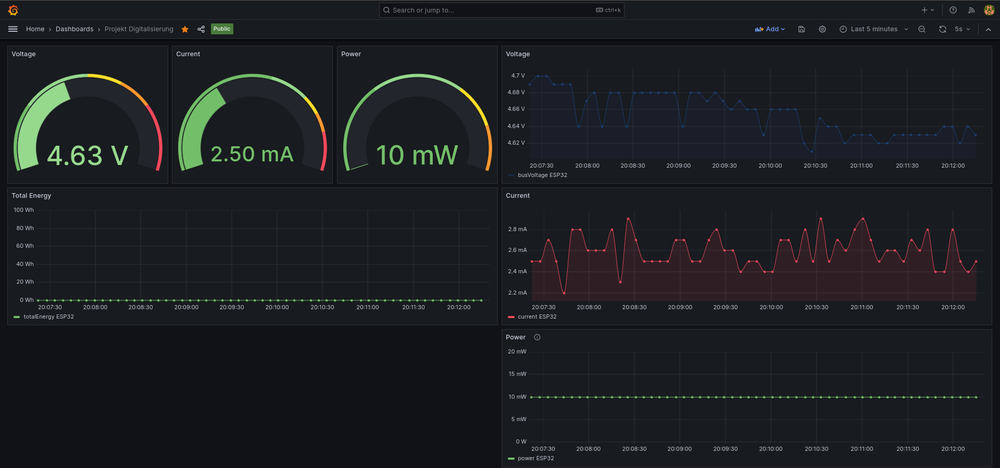
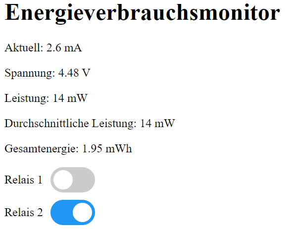

# ESP32-PowerGuard - Digitalization in Energy Engineering

This repository contains the source code for our university group project focused on digitalizing energy engineering in the industrial sector. Our project aims to ensure safe power distribution for retrofit mobile robots with capable mini PCs. However, we wanted to come up with a solution that can be applied to any power circuit. This led to a little project using ESP32 and some relay boards.

### Key Features:

- ESP32-based power monitoring for voltage and consumption.
- Integration of 2 relay boards to prevent unforeseen voltage conditions.
- Data logging to InfluxDB for comprehensive analysis.
- Grafana dashboard for visualizing power conditions.
- Embedded webserver on ESP32 for real-time voltage and power readings and relay control.

### Quick start
1. Spin up InfluxDb and Grafana via Docker Compose:

    ```shell
    docker compose up -d
    ```

2. Open this folder with Visual Studio Code and install the PlatformIO plugin.
3. Rename `secrets.h.example` to `secrets.h` and fill in your credentials.
4. Flash ESP32 with the code. Connect the INA219 module according to the schematics and power up the ESP32.
5. The ESP32 will connect to your WiFi and start sending data to the InfluxDB. InfluxDB webgui is available at [http://localhost:8087](http://localhost:8087). You can now start the Grafana dashboard and connect it to the InfluxDB. The Grafana dashboard is available at [http://localhost:3002](http://localhost:3002).
6. Control the ESP32 via the webserver at `http://<ESP_IP>:80`.
   You can obtain the ESP32 IP address from the serial console.

## Tutorial:
### Contents of this repository
- `platformio.ini`: Contains the configuration for the PlatformIO plugin.
- `docker-compose.yml`: Contains the configuration for the Docker Compose setup.
- `src`: Contains the source code for the ESP32.
- `doc`: Here you will find the schematics and the project documentation.

### Hardware needed:
- ESP32 Devkit C (or derivative)
- Relay Module board with 2x Relays
- INA219 Power Monitoring Module
- Computer/Server for hosting the Database and Grafana.
The code was written using the PlatformIO plugin for Visual Studio Code. You are advised to use the same setup.

Clone this repository:
```shell
git clone https://github.com/bjoernellens1/ESP32-PowerGuard.git
```

### Setup your services
Install the latest version of Docker and Docker Compose:
    [https://docs.docker.com/get-docker/](https://docs.docker.com/get-docker/)
Start the services via:
```shell
docker compose up -d
```

Now you can access Grafana and InfluxDB via the webgui.

The Grafana dashboard is available at [http://localhost:3002](http://localhost:3002).

InfluxDB webgui is available at [http://localhost:8087](http://localhost:8087).

Having the services running, it is time to start the setup wizard in InfluxDB. Login with username 'influxUser' and password 'influxUserPW' .
On the welcome page you will see the Ardino setup tutorial. Click on the 'Arduino' button and follow the instructions. Here you will obtain parameters needed in the next step.

### Setup ESP32
#### Hardware Setup
Connect the INA219 module according to the schematics. 
Connect the relay module to the ESP32. The relay module should be connected to the pins 26 and 27 of the ESP32. The relay module should be powered by an external power supply. The relay module should be connected to the power circuit you want to monitor and control. The INA219 module should be connected to the power circuit you want to monitor. The INA219 module should be powered by the ESP32.



#### Software Setup
Connect the ESP to your PC via USB cable. Install Visual Studio Code and the PlatformIO extension from the extension store.
Open this folder in Visual Studio Code. The PlatformIO welcome page will open automatically and needed packages should be installed.

Then you need to change some files to include your configuration:

Rename `secrets.h.example` to `secrets.h` and fill in your credentials. INFLUXDB_TOKEN is the token you obtained in the previous step. INFLUXDB_ORG is the organization name you chose. INFLUXDB_BUCKET is the bucket name you chose. INFLUXDB_URL is the URL of your InfluxDB instance. In our case we are hosting it locally, so we need to fill in the PCs IP Adress followed by the InfluxDB port, for instance:

```
INFLUXDB_URL = "http://192.168.1.100:8087"
```

 WIFI_SSID and WIFI_PASS are your WiFi credentials.
 

Now you can click on the upload button to flash the ESP.



Use the serial monitor to see the output of the ESP. You will see the IP address of the ESP. You can now access the webserver at `http://<ESP_IP>:80`.
Also, the ESP should now be able to send data to the database. Now the data should appear in the database and you should be greeted be able to configure these views:

##### Grafana


##### Webserver



Explore the code, contribute, and provide feedback.
