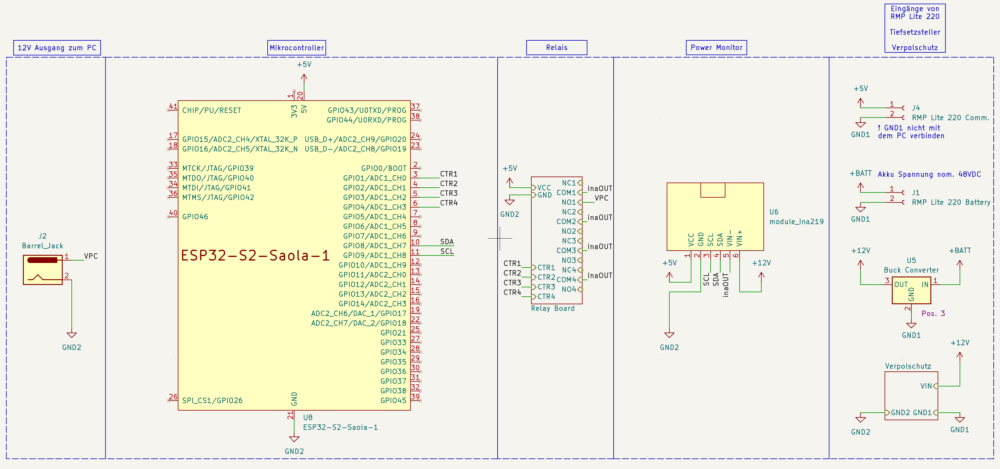

# ESP32-PowerGuard - Digitalization in Energy Engineering

This repository contains the source code for our university group project, focusing on digitalizing in the energy technology sector. Our project aims to ensure safe power distribution for retrofit mobile robots with capable mini PCs. We developed a solution using ESP32 and relay boards, which can be applied to any power circuit.

## Key Features:

- ESP32-based power monitoring for voltage and consumption.
- Integration of 2 relay boards to prevent unforeseen voltage conditions.
- Data logging to InfluxDB for comprehensive analysis.
- Grafana dashboard for visualizing power conditions.
- Embedded webserver on ESP32 for real-time voltage and power readings and relay control.

## Important notice:

This code is designed to work with various ESP32 devices (ESP32, ESP32-S1, ESP32-S2, etc.), but minor adjustments may be needed. Additionally, you will need to adapt the pin numbering to your specific board. The code has been successfully tested with the following devices:
- AZ Delivery ESP-32 Dev Kit C V4
- ESP32-S2-Saola-1

The relay module is interchangeable with other relay modules available on Amazon. The code is written for active-low relay modules.

## Quick start

0. **Before connecting the ESP via USB,** ensure to unplug the additional 5V power converter used in this project to prevent overpowering the computer's USB port.
1. Spin up InfluxDb and Grafana via Docker Compose:

    ```shell
    docker compose up -d
    ```

2. Open this folder with Visual Studio Code and install the PlatformIO plugin.
3. Rename `secrets.h.example` to `secrets.h` and fill in your credentials.
4. Flash ESP32 with the code. Connect the INA219 module according to the schematics and power up the ESP32.
5. The ESP32 will connect to your WiFi and start sending data to InfluxDB. The InfluxDB web GUI is available at [http://localhost:8086](http://localhost:8086). Start the Grafana dashboard and connect it to InfluxDB, accessible at [http://localhost:3000](http://localhost:3000).
6. Control the ESP32 via the webserver at `http://<ESP_IP>:80`. Obtain the ESP32 IP address from the serial console.

## Tutorial:

### Contents of this repository
- `platformio.ini`: Contains the configuration for the PlatformIO plugin.
- `docker-compose.yml`: Contains the configuration for the Docker Compose setup.
- `src`: Contains the source code for the ESP32.
- `doc`: Here you will find the schematics and the project documentation.

### Hardware needed:
- ESP32-S2-Saola-1 (or derivative)
- Relay Module board with 4x Relays (or any other type)
- INA219 Power Monitoring Module
- Computer/Server for hosting the Database and Grafana.

The code was written using the PlatformIO plugin for Visual Studio Code. You are advised to use the same setup.

Clone this repository:

```shell
git clone https://github.com/bjoernellens1/ESP32-PowerGuard.git
```

### Setup your services

Install the latest version of Docker and Docker Compose: [https://docs.docker.com/get-docker/](https://docs.docker.com/get-docker/)

Start the services via:

```shell
docker compose up -d
```

Now access Grafana and InfluxDB via the web GUI.

- The Grafana dashboard is available at [http://localhost:3000](http://localhost:3000).
- InfluxDB web GUI is available at [http://localhost:8086](http://localhost:8086).

With the services running, start the setup wizard in InfluxDB. Login with username 'influxUser' and password 'influxUserPW'. On the welcome page, click on the 'Arduino' button and follow the instructions. Here, you will obtain parameters needed in the next step.

### Setup ESP32

#### Hardware Setup

- Connect the INA219 module according to the schematics.
- Connect the relay module to the ESP32, with the relay module connected to the pins GPIO2 and GPIO15 of the ESP32. Power the relay module externally.
- The relay module should be connected to the power circuit to monitor and control.
- The INA219 module should be connected to the power circuit to monitor and powered by the ESP32.

[Pinout Diagram ESP32-S2-Saola-1](https://docs.espressif.com/projects/esp-idf/en/stable/esp32s2/_images/esp32-s2_saola1-pinout.jpg)



#### Software Setup

1. Connect the ESP to your PC via a USB cable.
2. Install Visual Studio Code and the PlatformIO extension from the extension store.
3. Open this folder in Visual Studio Code. The PlatformIO welcome page will open automatically, and needed packages should be installed.

Change some files to include your configuration:

- Rename `secrets.h.example` to `secrets.h` and fill in your credentials.
- `INFLUXDB_TOKEN` is the token obtained in the previous step.
- `INFLUXDB_ORG` is the organization name chosen.
- `INFLUXDB_BUCKET` is the bucket name chosen.
- `INFLUXDB_URL` is the URL of the InfluxDB instance. If hosted locally, fill in the PC's IP Address followed by the InfluxDB port, for instance:

    ```plaintext
    INFLUXDB_URL = "http://192.168.1.100:8086"
    ```

- `WIFI_SSID` and `WIFI_PASS` are your WiFi credentials.

Ensure the correct environment is selected for the project, defaulting to ESP32-S2-Saola-1. You can change the environment in the bottom bar of Visual Studio Code.


Now, click on the upload button to flash the ESP.


Use the serial monitor to see the ESP's output, showing the ESP's IP address. Access the webserver at `http://<ESP_IP>:80`. The ESP should now send data to the database, visible in the Grafana dashboard:

- **Grafana**
  

- **Webserver**
  

### Further information

For more information, check out these links:

- [Grafana](https://grafana.com/)
- [InfluxDB](https://www.influxdata.com/)
- [PlatformIO](https://platformio.org/)
- [Visual Studio Code](https://code.visualstudio.com/)

Explore the code, contribute, and provide feedback. Special thanks to my project buddies Yiuliya Varsh and Cyrus Emami for their support and help at this point.
